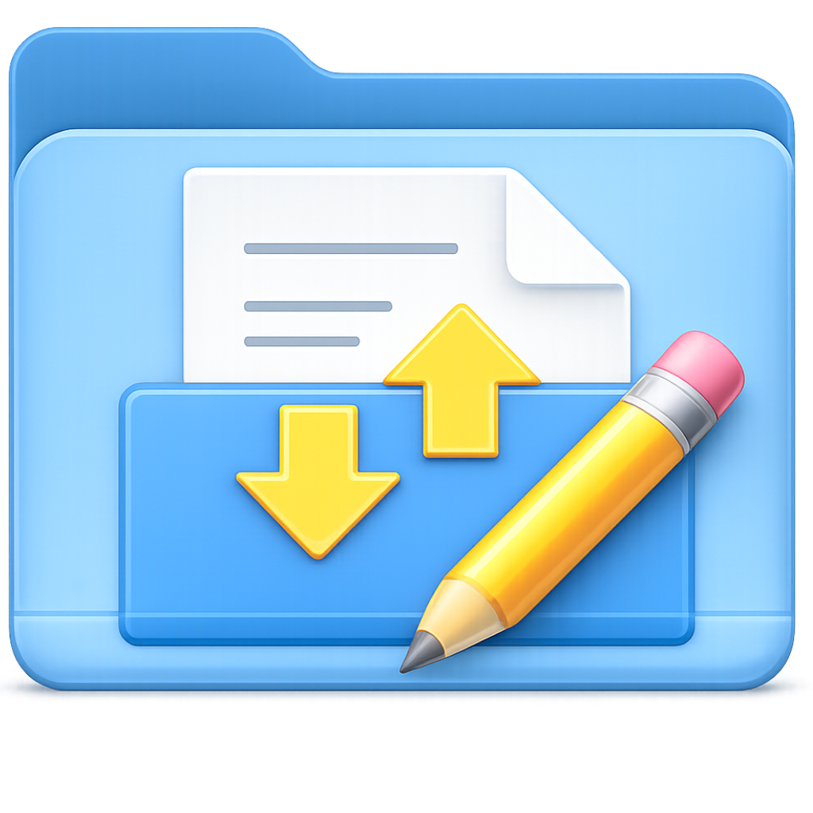
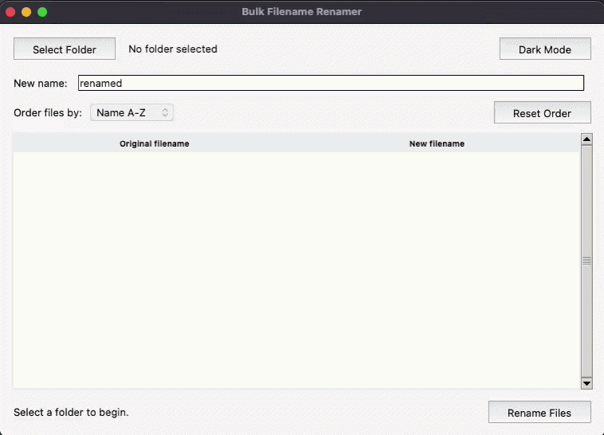
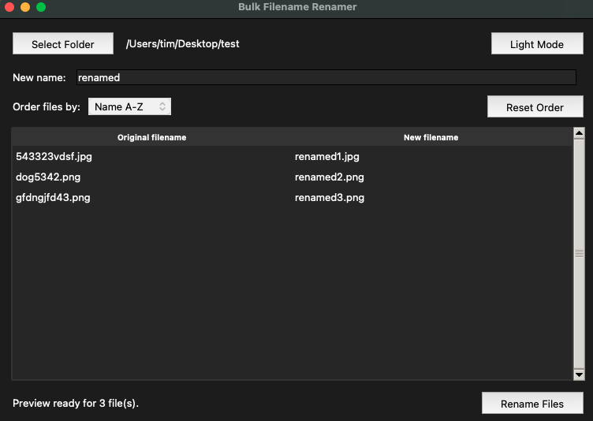
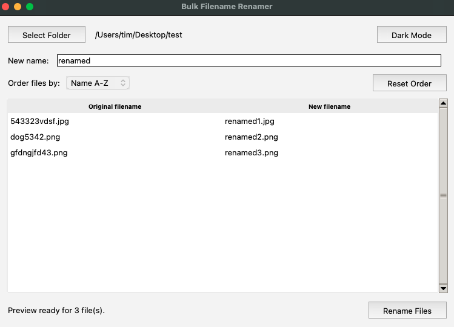
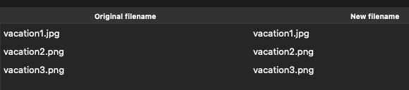

# Bulk Filename Renamer

  

  

Bulk Filename Renamer is a lightweight offline desktop utility for renaming many files quickly and safely.

Built for:

- freelancers
- students
- photographers
- content creators
- office workflows
- messy download folders

## Features

- Bulk rename many files at once
- Preview changes before applying
- Add prefixes or suffixes
- Organize filenames quickly
- Offline workflow
- No login
- No subscriptions
- No cloud upload

## Why This Tool Exists

Most bulk renaming tools are:

- bloated
- outdated
- overly technical
- subscription-based
- overkill for simple rename tasks

Bulk Filename Renamer focuses on speed and simplicity.

## Download

Get the app here:

- Gumroad: [CLICK HERE](https://gallonlabs.gumroad.com/l/bulk-filename-renamer-mac)
- itch.io: [CLICK HERE](https://tinyutilitylab.itch.io/bulk-filename-renamer)

## Screenshots

### Dark Mode

### Light Mode

### Rename Preview

## System

macOS

## Version

v1.0

## Note

This repository is a public product page only. Source code is private.
